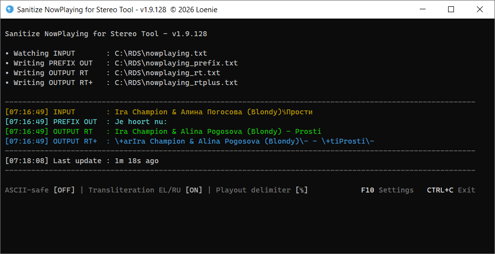
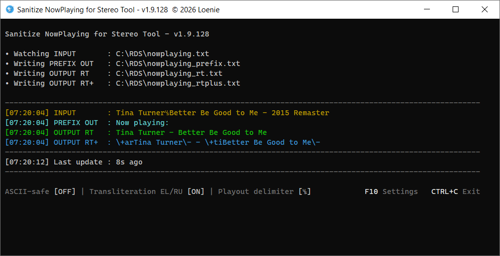
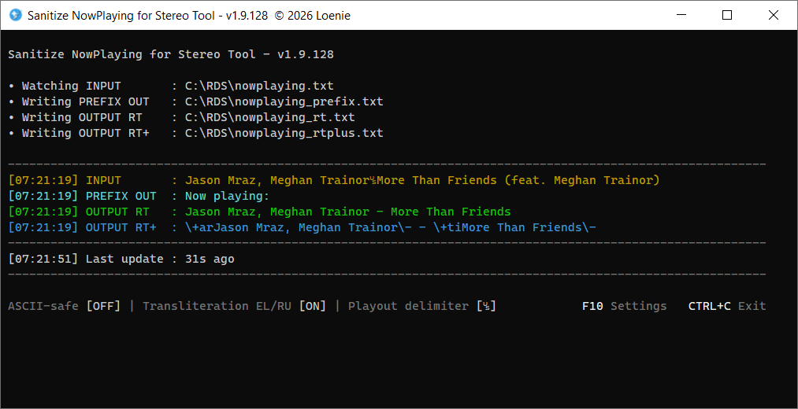
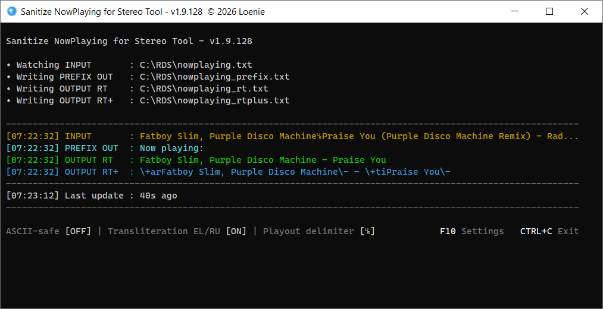
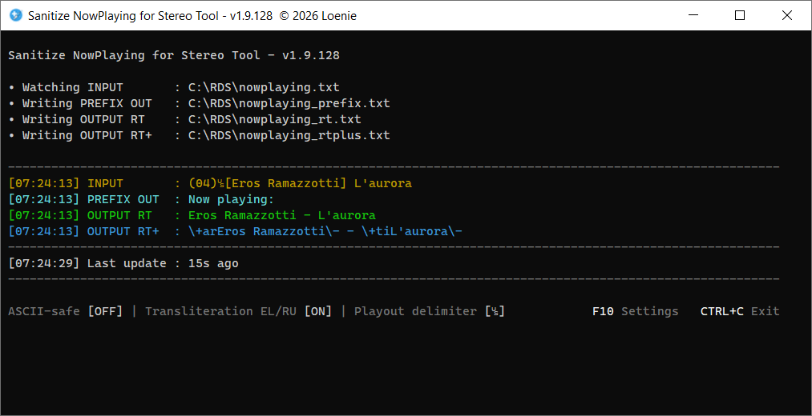
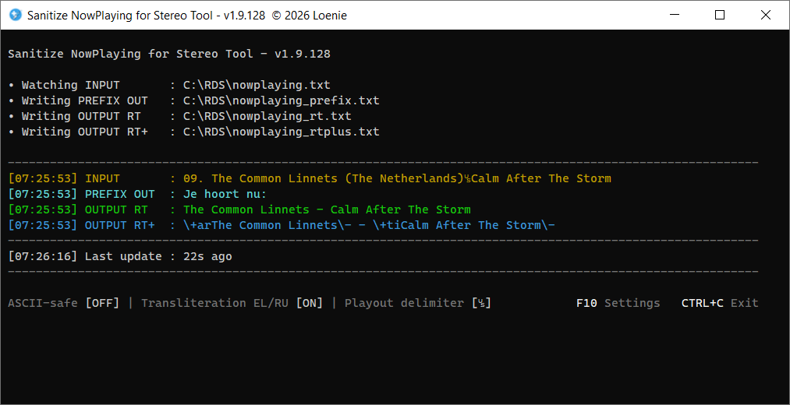
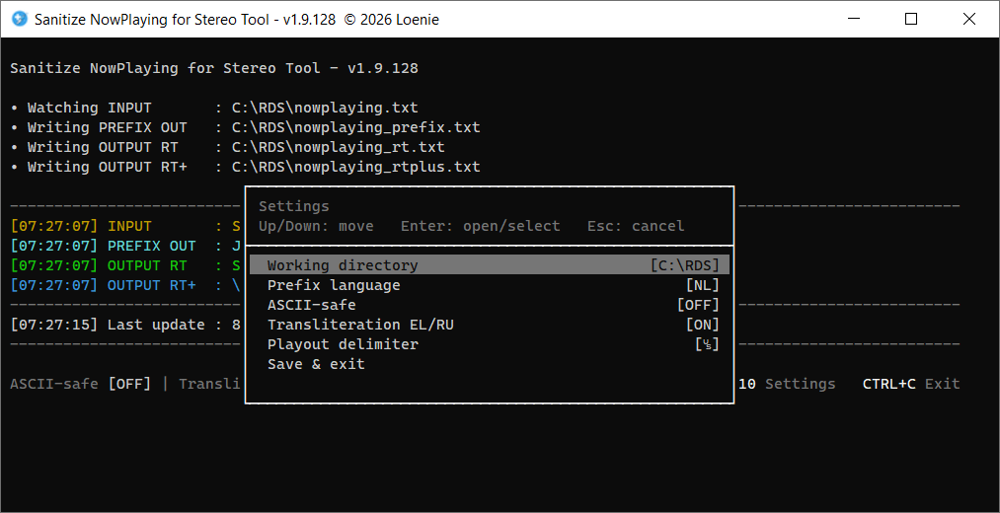
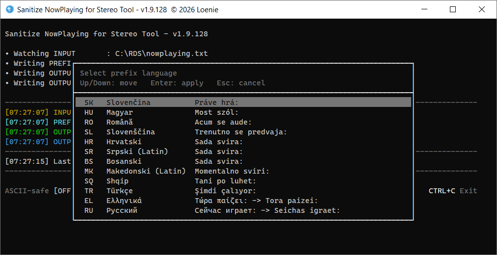

# Sanitize NowPlaying for Stereo Tool

Lightweight PowerShell tool that cleans and normalizes nowplaying.txt metadata for reliable RDS RadioText (RT and RT+).

Designed for hobby and semi-professional FM stations that want clean, broadcast-ready RDS RadioText with minimal manual library tagging.

This project was created through iterative co-development with ChatGPT 5.2, combining AI-assisted development with hands-on design, testing, and optimizations.

# Features

- Real-time monitoring of nowplaying.txt from playout software, such as RadioBOSS and the like
- Intelligent cleanup of artist/title (removes encoders, bitrates, countries, platform tags, duplicate info, etc.)
- Smart handling of brackets, “feat.” and common metadata noise
- Adaptive trimming to the RDS 64-character limit with priority-based shortening for optimal readability
- Optional transliteration (Cyrillic/Greek) and ASCII-safe mode
- Clean output for RT and RT+ (artist/title tagging)
- Multilingual “Now playing” prefix
- Configurable (including custom) field delimiter
- Color console UI with status view and F10 settings menu
- Persistent JSON configuration and single-instance protection
- Runs on Windows 10/11 (script or standalone .exe)

# Usage

Run the script from a command prompt:

    PowerShell -NoProfile -ExecutionPolicy Bypass -File .\sanitize-nowplaying.ps1

You may have to allow local scripts first (one-time step): 
    
    PowerShell Set-ExecutionPolicy RemoteSigned -Scope CurrentUser

Alternatively, you can run the standalone .exe (contained within Sanitize-NowPlaying.zip), which requires no PowerShell configuration.

In your playout software, configure "nowplaying.txt" to be written to the selected working directory (eg. C:\RDS). 
Match the field delimiter symbol(s) between %artist and %title in your playout software to the symbol(s) as set in the F10-menu: Playout delimiter. The actual chosen delimiter will be copied to the clipboard for your convenience. If the recommended "␟"-symbol is used as the delimiter symbol, the Metadata setting in the playout software would then become "%artist␟%title".

# Example screenshots

