# Sanitize NowPlaying for Stereo Tool

Lightweight PowerShell tool that monitors and normalizes `nowplaying.txt` metadata into six clean output files for reliable RDS RadioText (RT and RT+) and flexible Stereo Tool workflows.

Designed for small and semi-professional FM stations that want clean, broadcast-ready RDS metadata with minimal manual library tagging.

This project was created through iterative co-development, combining AI-assisted development with hands-on design, testing, and optimization.

# Features

- Real-time monitoring of `nowplaying.txt` from playout software such as RadioBOSS
- Intelligent artist/title cleanup (encoders, bitrates, countries, platform tags, duplicate information, etc.)
- Smart handling of brackets, “feat.” and other common metadata noise
- Ready-to-use compact RT and RT+ output files
- Separate PREFIX, ARTIST, CONNECTOR and TITLE files for flexible composition in Stereo Tool or another RDS encoder
- Independent adaptive 64-character processing for the ARTIST and TITLE component files
- Adaptive trimming of combined RT/RT+ content to the RDS 64-character limit
- Configurable artist/title order, multilingual or custom prefix text, connector text and playout delimiter
- Optional Greek/Cyrillic transliteration and ASCII-safe mode
- Redesigned color console UI separating LOCATION, FILES, CONTENT and LAST UPDATE information
- Per-file output status, atomic writes, visible `WRITE FAILED` reporting and automatic retries
- Startup freshness handling and automatic output flush on exit to prevent stale RDS data
- Persistent JSON configuration and single-instance protection
- Runs on Windows 10/11 as a PowerShell script or standalone `.exe`

# Output files

All output files are written as UTF-8 without BOM in the selected working directory.

| File | Contents |
| --- | --- |
| `nowplaying_prefix.txt` | Selected multilingual prefix or custom prefix text, or empty |
| `nowplaying_artist.txt` | Sanitized artist, independently limited to 64 characters, or empty |
| `nowplaying_connector.txt` | Configured connector with surrounding spaces when both artist and title are present, or empty |
| `nowplaying_title.txt` | Sanitized title, independently limited to 64 characters, or empty |
| `nowplaying_rt.txt` | Compact combined RadioText in the configured artist/title order, or empty |
| `nowplaying_rtplus.txt` | Compact RT+ tagged text in the same configured order, or empty |

The component files can be read separately when Stereo Tool should assemble the on-air text itself. The RT and RT+ files remain ready-made outputs for a simpler setup.

# Usage

Save the standalone `.exe` (included in `Sanitize-NowPlaying.zip`) to any directory with write permissions and run it from there. The application stores its JSON settings file in the same location. No PowerShell configuration is required.

When running on Windows 11, the application may open inside Windows Terminal tabs.  
For best compatibility, it is recommended to run it using the classic console host (`conhost.exe`). Create a shortcut and set the target to:

    conhost.exe "<full-path>\Sanitize-NowPlaying.exe"

Example:

    conhost.exe "C:\RDS\Sanitize-NowPlaying.exe"

 

Alternatively, you can run the script from a command prompt:

    PowerShell -NoProfile -ExecutionPolicy Bypass -File .\sanitize-nowplaying.ps1

You may first have to allow local scripts (one-time step):

    PowerShell Set-ExecutionPolicy RemoteSigned -Scope CurrentUser

 

In your playout software, configure `nowplaying.txt` to be written to the selected working directory (for example `C:\RDS`).

Ensure that the field delimiter used between `%artist` and `%title` matches the delimiter configured under **Playout delimiter** in the F10 settings menu. The selected delimiter is automatically copied to the clipboard for convenience. For example, when the recommended `␟` character is used, the metadata setting in the playout software should be:

    "%artist␟%title"

Use the F10 menu to configure the working directory, prefix text, artist/title order, connector text, ASCII-safe mode, Greek/Cyrillic transliteration and playout delimiter.

Then configure Stereo Tool (or another RDS encoder) to read either the ready-made RT/RT+ files or the separate component files required by your workflow.

# Stereo Tool component example

The separate component files can be combined as an alternating RadioText sequence in Stereo Tool. The following example can be used as a starting point:

    5s:\r"C:\RDS\prefix.txt"/10s:\+AR\r"C:\RDS\artist.txt"\-/5s:\r"C:\RDS\connector.txt"/10s:\+TI\r"C:\RDS\title.txt"\-

This displays the prefix for 5 seconds, the artist for 10 seconds with an RT+ artist tag, the connector for 5 seconds, and the title for 10 seconds with an RT+ title tag. Adjust the timings, paths and order to suit your own RDS presentation.

**Synchronization note:** Stereo Tool reads each referenced component file only when that particular section becomes active, rather than caching all files at the start of the sequence. If the song changes during the sequence, artist and title components from two adjacent songs can therefore be combined. The sanitizer replaces each individual file atomically, but cannot make several separately read files act as one shared snapshot. Use the ready-made RT/RT+ files when guaranteed artist/title consistency is more important than separate component rotation.

# Example screenshots

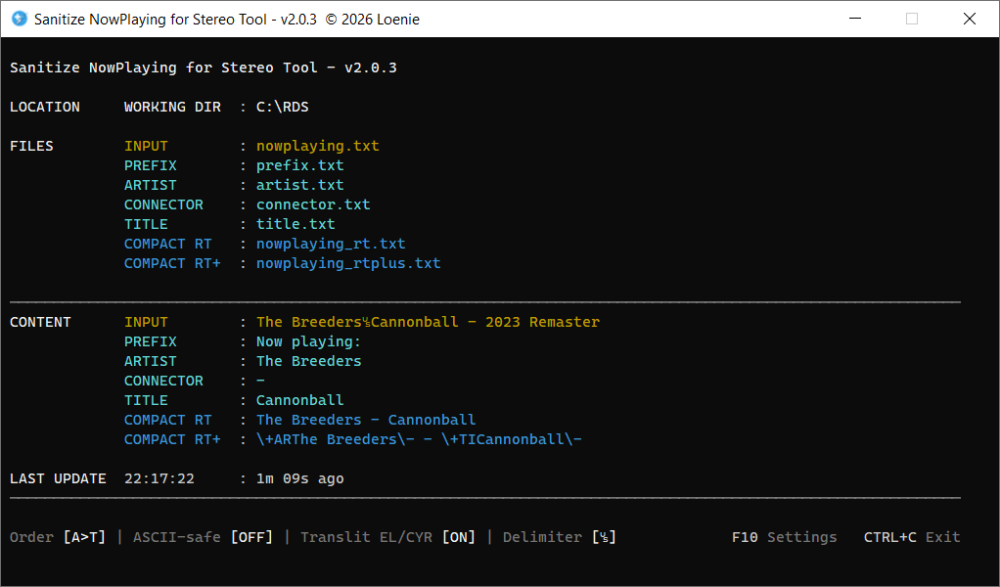

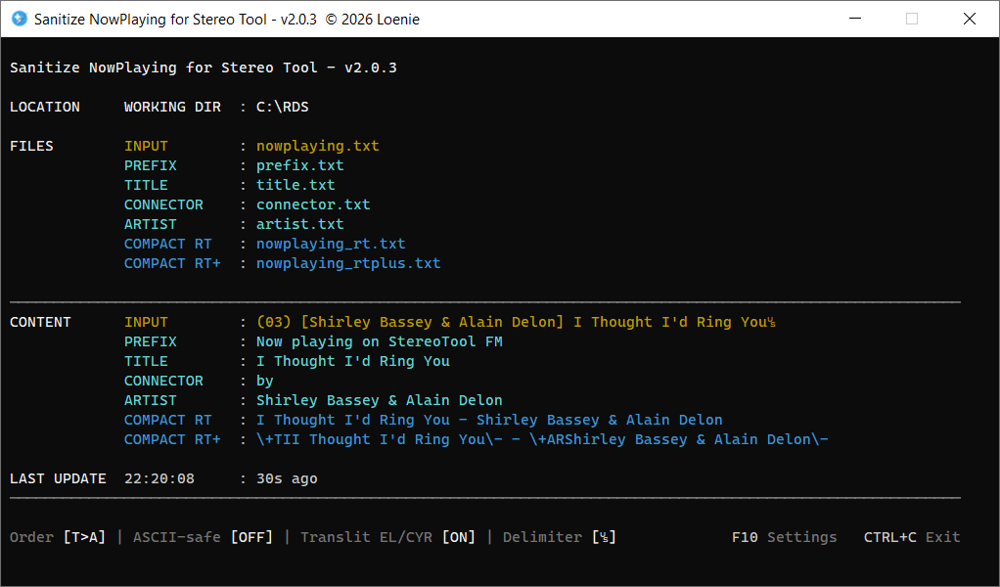

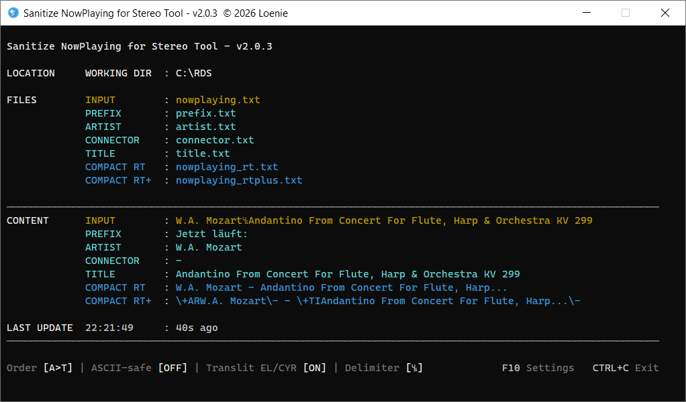

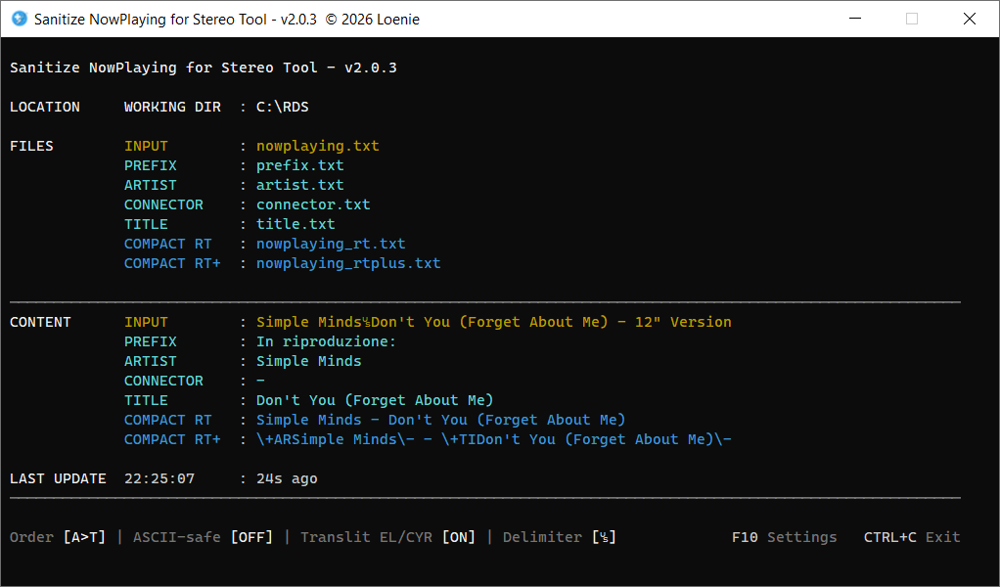

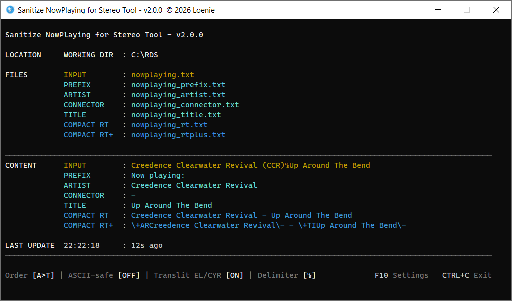

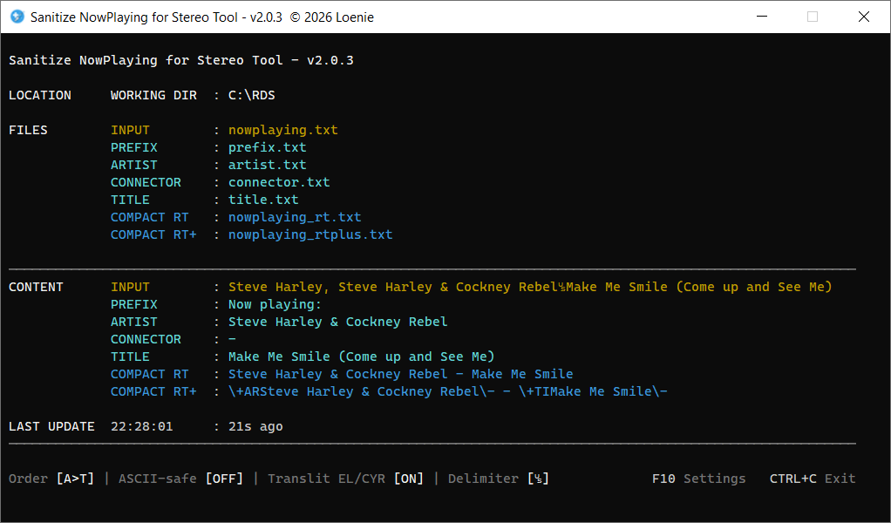

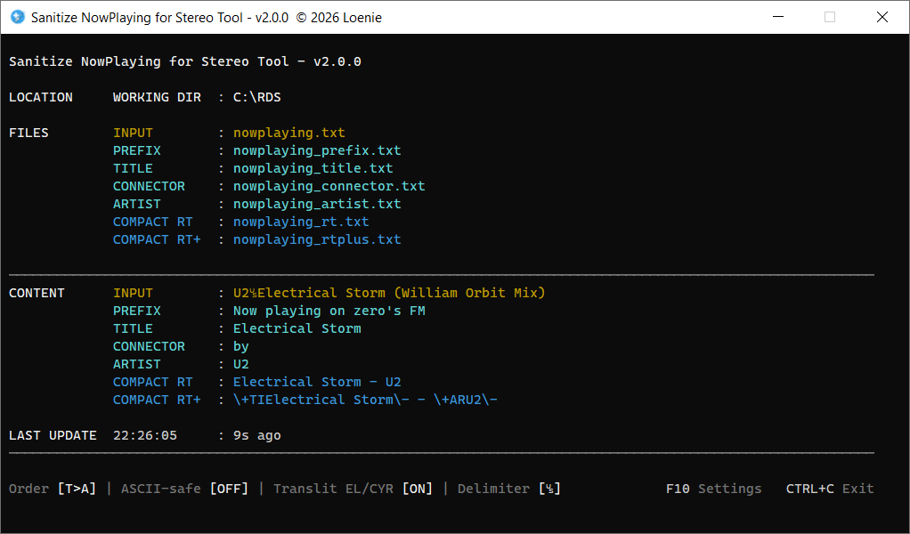

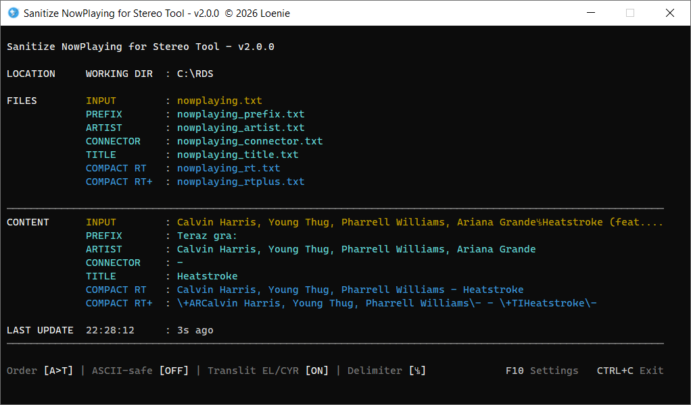

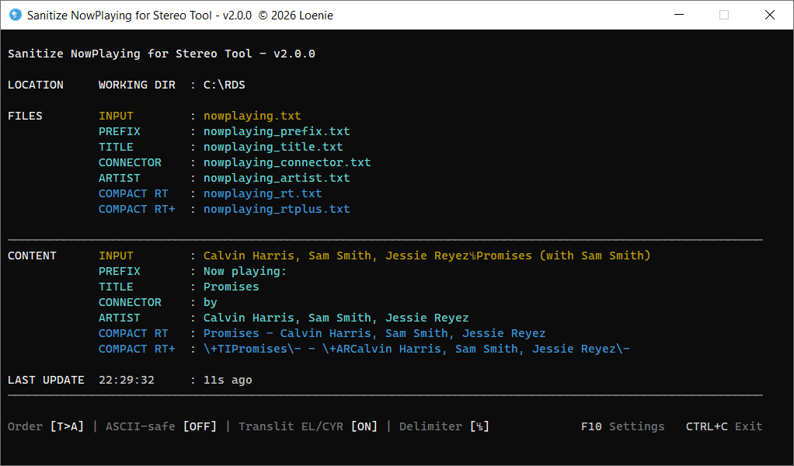

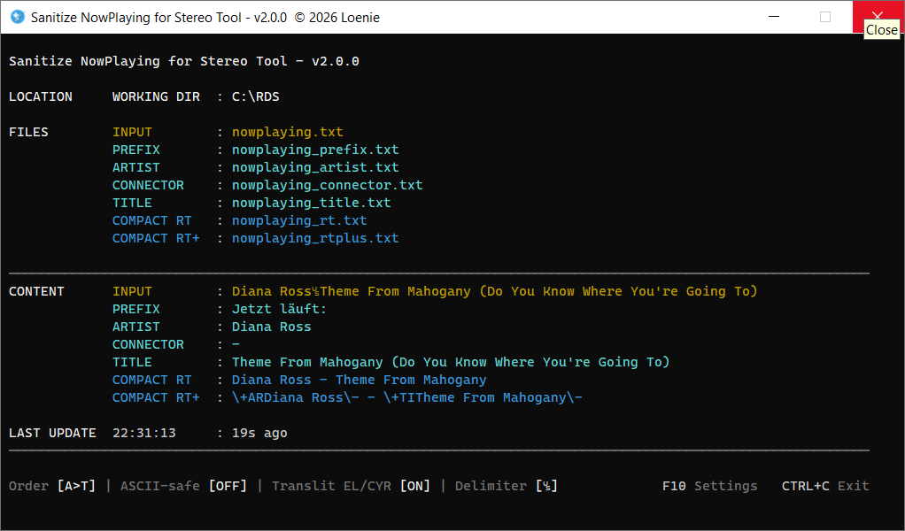

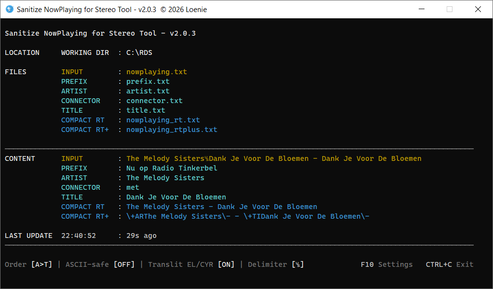

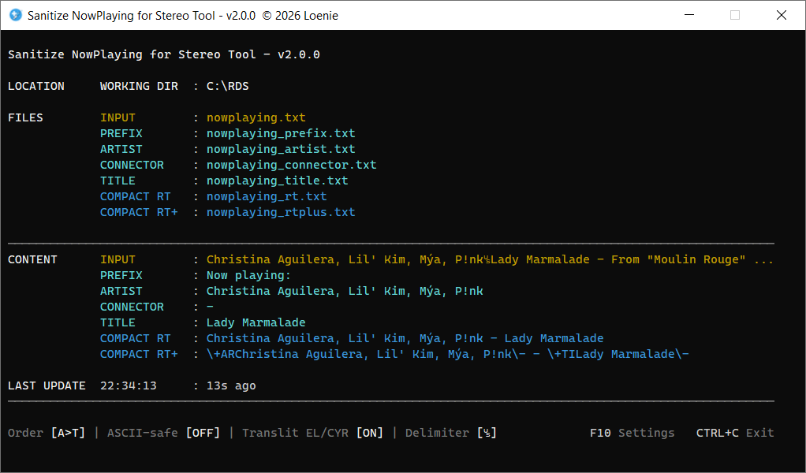

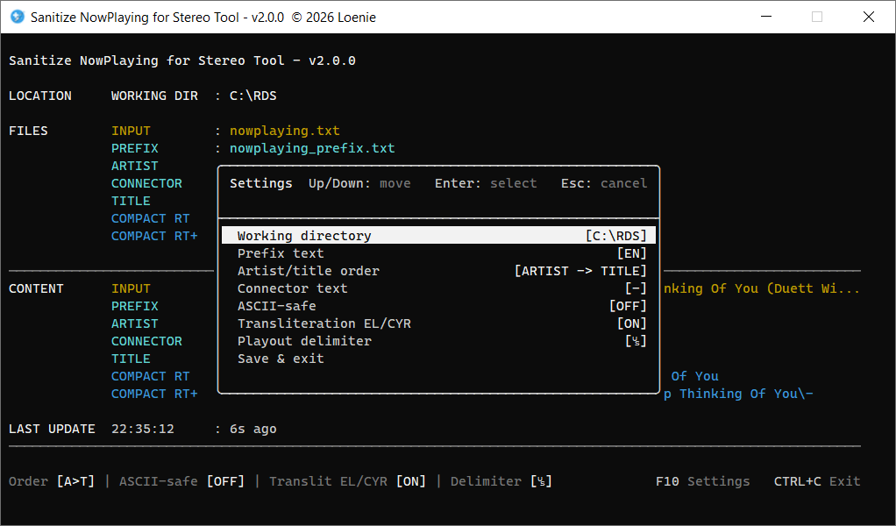

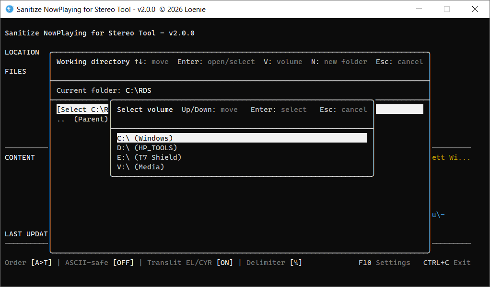

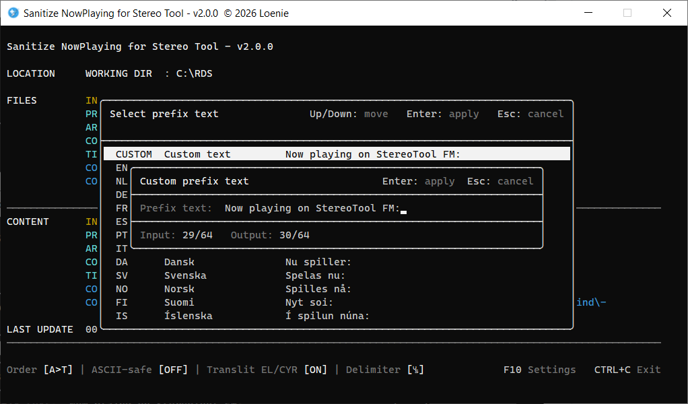

# Disclaimer

Stereo Tool is a product of Thimeo Audio Technology B.V. This project is not affiliated with or endorsed by Thimeo Audio Technology B.V.
